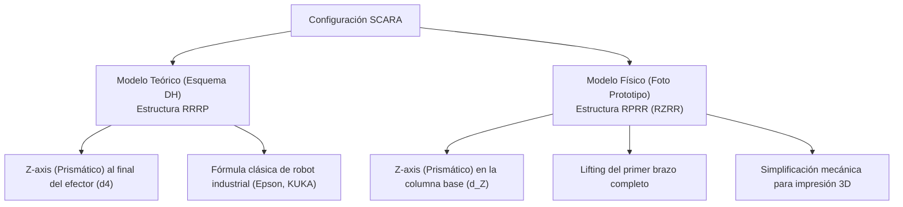

# ANÁLISIS CINEMÁTICO: MODELADO POR DENAVIT-HARTENBERG Y COMPARATIVA DE DISEÑO
## PROYECTO ROBOT SCARA
**Facultad de Ciencias de la Alimentación - UNER**

---

Este documento presenta el **Modelado Matemático por Denavit-Hartenberg (D-H)** del robot SCARA, tomando como referencia el esquema teórico de articulaciones y el diseño físico del prototipo. El objetivo es proporcionar un marco analítico estructurado que sirva como plano matemático de referencia para el avance del proyecto, permitiendo su posterior modificación y ajuste a medida que avance la construcción.

---

## 1. COMPARATIVA DE CONFIGURACIONES CINEMÁTICAS

Al analizar tu plan de trabajo, identificamos dos configuraciones que conviven en el desarrollo: el modelo académico del esquema y el prototipo real impreso en 3D.



### Tabla Comparativa de Articulaciones

| Junta | Tipo en Modelo Teórico (Esquema) | Tipo en Modelo Físico (Prototipo Real) | Variable Física |
| :--- | :--- | :--- | :--- |
| **Junta 1 (Base)** | Rotacional ($\theta_1$) | Rotacional ($\theta_1$) | Giro del hombro en el plano XY |
| **Junta 2 (Codo)** | Rotacional ($\theta_2$) | **Prismática ($d_Z$)** | Elevación del brazo completo en el eje Z |
| **Junta 3 (Muñeca)** | Rotacional ($\theta_3$) | **Rotacional ($\theta_2$)** | Giro del antebrazo en el plano XY |
| **Junta 4 (Herramienta)** | **Prismática ($d_4$)** | **Rotacional ($\theta_3$)** | Giro del Gripper (Orientación) |

---

## 2. MODELO DE DENAVIT-HARTENBERG 1: ESQUEMA TEÓRICO (RRRP)

Basándonos estrictamente en el diagrama de marcos de coordenadas que adjuntaste ([Ver Esquema DH de Usuario](file:///c:/Users/diego/OneDrive/Desktop/DIEGO%20FCAL/PROYECTO_MECANISMOS_SCARA/esquema_dh_usuario.png)):


### 2.1. Tabla de Parámetros de Denavit-Hartenberg (RRRP)

| Eslabón ($i$) | $\theta_i$ (Rotación en $Z$) | $d_i$ (Distancia en $Z$) | $a_i$ (Longitud en $X$) | $\alpha_i$ (Torsión en $X$) |
| :---: | :---: | :---: | :---: | :---: |
| **1** | $\theta_1^*$ | $d_1$ | $l_1$ | $0^\circ$ |
| **2** | $\theta_2^*$ | $0$ | $l_2$ | $0^\circ$ |
| **3** | $\theta_3^*$ | $0$ | $0$ | $180^\circ$ |
| **4** | $0^\circ$ | $d_4^*$ | $0$ | $0^\circ$ |

*Nota: Los asteriscos ($^*$) denotan las variables articulares.*

### 2.2. Matrices de Transformación Homogénea ($T_i^{i-1}$)

La matriz de paso general de un eslabón a otro responde a la fórmula estándar:

$$A_i = \begin{bmatrix} \cos\theta_i & -\sin\theta_i\cos\alpha_i & \sin\theta_i\sin\alpha_i & a_i\cos\theta_i \\ \sin\theta_i & \cos\theta_i\cos\alpha_i & -\cos\theta_i\sin\alpha_i & a_i\sin\theta_i \\ 0 & \sin\alpha_i & \cos\alpha_i & d_i \\ 0 & 0 & 0 & 1 \end{bmatrix}$$

Sustituyendo los parámetros D-H para cada junta del esquema RRRP:

*   **Matriz $A_1$ (Eslabón 1):**
    $$A_1 = \begin{bmatrix} \cos\theta_1 & -\sin\theta_1 & 0 & l_1\cos\theta_1 \\ \sin\theta_1 & \cos\theta_1 & 0 & l_1\sin\theta_1 \\ 0 & 0 & 1 & d_1 \\ 0 & 0 & 0 & 1 \end{bmatrix}$$

*   **Matriz $A_2$ (Eslabón 2):**
    $$A_2 = \begin{bmatrix} \cos\theta_2 & -\sin\theta_2 & 0 & l_2\cos\theta_2 \\ \sin\theta_2 & \cos\theta_2 & 0 & l_2\sin\theta_2 \\ 0 & 0 & 1 & 0 \\ 0 & 0 & 0 & 1 \end{bmatrix}$$

*   **Matriz $A_3$ (Eslabón 3 - Muñeca Rotacional):**
    $$A_3 = \begin{bmatrix} \cos\theta_3 & \sin\theta_3 & 0 & 0 \\ \sin\theta_3 & -\cos\theta_3 & 0 & 0 \\ 0 & 0 & -1 & 0 \\ 0 & 0 & 0 & 1 \end{bmatrix}$$

*   **Matriz $A_4$ (Eslabón 4 - Efector Prismático):**
    $$A_4 = \begin{bmatrix} 1 & 0 & 0 & 0 \\ 0 & 1 & 0 & 0 \\ 0 & 0 & 1 & d_4 \\ 0 & 0 & 0 & 1 \end{bmatrix}$$

La cinemática directa completa se obtiene multiplicando sucesivamente las matrices:

$$T_4^0 = A_1 \cdot A_2 \cdot A_3 \cdot A_4$$

---

## 3. MODELO DE DENAVIT-HARTENBERG 2: PROTOTIPO FÍSICO REAL (RPRR)

Basándonos en la foto de tu prototipo real impreso en 3D ([Ver Foto de Prototipo](file:///c:/Users/diego/OneDrive/Desktop/DIEGO%20FCAL/PROYECTO_MECANISMOS_SCARA/foto_robot_usuario.png)):


Aquí, el eje vertical (Z) se encuentra en la torre principal (segunda junta cinemática). La primera articulación rota la torre completa (hombro), la torre eleva o desciende el brazo en su conjunto, y el brazo y antebrazo realizan el resto de los giros.

### 3.1. Tabla de Parámetros de Denavit-Hartenberg (RPRR)

| Eslabón ($i$) | $\theta_i$ (Rotación en $Z$) | $d_i$ (Distancia en $Z$) | $a_i$ (Longitud en $X$) | $\alpha_i$ (Torsión en $X$) |
| :---: | :---: | :---: | :---: | :---: |
| **1** | $\theta_1^*$ | $H_{\text{base}}$ | $0$ | $0^\circ$ |
| **2** | $0^\circ$ | $d_Z^*$ | $l_1$ | $0^\circ$ |
| **3** | $\theta_2^*$ | $0$ | $l_2$ | $0^\circ$ |
| **4** | $\theta_3^*$ | $0$ | $0$ | $0^\circ$ |

*Nota: Aquí las variables del robot son $\theta_1^*$, $d_Z^*$ (desplazamiento vertical de la columna), $\theta_2^*$ (codo relativo) y $\theta_3^*$ (giro de orientación del efector).*

### 3.2. Ecuaciones Resultantes de Posición (Efector Final)

Al desarrollar la matriz de transformación para el robot físico real, obtenemos:

$$x = l_1 \cos(\theta_1) + l_2 \cos(\theta_1 + \theta_2)$$

$$y = l_1 \sin(\theta_1) + l_2 \sin(\theta_1 + \theta_2)$$

$$z = H_{\text{base}} + d_Z$$

> [!NOTE]
> **Observación de Diseño Importante**: Físicamente, la posición en el plano horizontal $(x, y)$ depende exclusivamente de $\theta_1$ y $\theta_2$, al igual que en el modelo teórico. La gran ventaja constructiva del prototipo RPRR es que el actuador pesado del eje Z (motor y husillo) se apoya en la base fija, reduciendo drásticamente el peso que deben mover los motores del plano XY ($M_1$ y $M_2$).

---

## 4. ANÁLISIS ESTRUCTURAL E INERCIAL PARA MODIFICACIONES FUTURAS

A medida que realices modificaciones físicas en el diseño (por ejemplo, variando la longitud de los brazos o la masa del efector final), debes recalcular los siguientes esfuerzos críticos:

```
                  [Esfuerzos Físicos a Monitorear]
                                |
        +-----------------------+-----------------------+
        |                                               |
[Par Torsional Cíclico]                      [Flexión Cortante]
- Crítico en Joint A y B.                    - Carga máxima en las guías
- Incrementa con L y la masa.                del eje Z al extender el brazo.
- Requiere acoples de gran filete.           - Genera fatiga en el soporte en U.
```

1.  **Par Torsional en las Juntas**:
    Si modificas el largo del brazo $l_1$ de $20\text{ cm}$ a $25\text{ cm}$, el momento de inercia del eslabón aumenta proporcionalmente al cuadrado del largo ($I \propto L^2$). Esto multiplicará los requerimientos de torque del servomotor MG996R en las aceleraciones.
2.  **Flexión en la Torre del Eje Z**:
    Al extender completamente el brazo ($R = l_1 + l_2$), la carga de la pinza y el antebrazo genera un momento flector máximo en la base del carro deslizante del eje Z. 
    *Fórmula del Momento Flector Estático:*
    $$M_f = P_{\text{payload}} \cdot (l_1 + l_2) + P_{\text{brazo2}} \cdot (l_1 + \frac{l_2}{2}) + P_{\text{brazo1}} \cdot \frac{l_1}{2}$$
    Este esfuerzo tiende a flexionar las barras calibradas del eje Z. Si aumentas la longitud de los brazos, deberás aumentar el diámetro de las barras de acero (de $10\text{ mm}$ a $12\text{ mm}$) para evitar vibraciones en la punta.

---

## 5. CONCLUSIÓN E INTEGRACIÓN CON LA WEB INTERACTIVA

Este documento constituye el **mapa de control cinemático** de tu robot. La calculadora de cinemática inversa y directa de la página web interactiva (`index.html`) ha sido programada con estas ecuaciones geométricas exactas de posición. 

Si en el futuro decides variar las dimensiones de diseño (por ejemplo, eslabones desiguales como $l_1 = 22.8\text{ cm}$ y $l_2 = 13.65\text{ cm}$ del robot de Lorente), solo debes actualizar los valores en los campos de variables correspondientes de la memoria y la página web para recalcular el comportamiento dinámico al instante.
